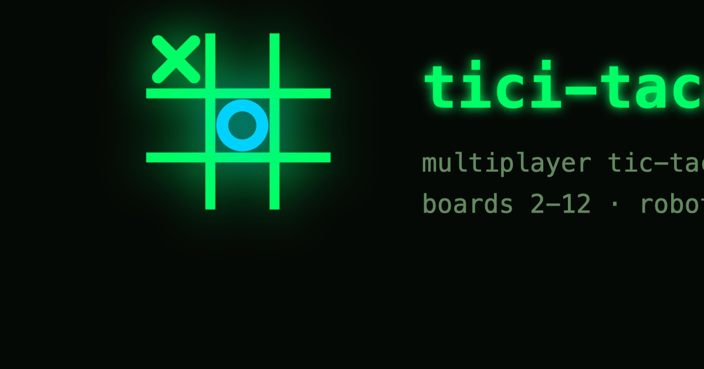

A multiplayer game of tic tac toe over websockets, with configurable board
sizes (2-12), player counts (2-10), winning sequence lengths, spectators, and
QR-code game invites. Built in 2020, revived in 2026, intended to run for
decades.

Made with ♥ in Bengaluru, India.

## Layout

- [`web/`](./web/) - the React web client (terminal/matrix styled, dark mode
  first). Runtime dependencies: `react` and `react-dom`, nothing else.
  Bundled and served by [Bun](https://bun.sh).
- [`server/`](./server/) - the websocket game server. **Zero runtime
  dependencies**, built on Bun primitives. Includes chess clocks,
  reconnect-and-resume, a robot scheduler, and TTN game notation.
- [`sdk/`](./sdk/) - the zero-dependency robot SDK: write a robot in ~10
  lines.
- [`robots/`](./robots/) - runnable reference robots (rando, greedo,
  minnie-max).
- [`playground/`](./playground/) - the learning lab: train a policy from
  recorded TTN games + self-play, then seat it as the `cloney` robot.
- [`mcp/`](./mcp/) - the MCP play service: AI agents connect over the
  Model Context Protocol and play like everyone else. Point any MCP client
  at `https://ticitacatoey.com/mcp` - no install.
- [`mobile/`](./mobile/) - bare React Native app (`com.ticitacatoey`),
  runtime deps `react` + `react-native` only.

The previously separate
[tici-taca-toey-server](https://github.com/team-black-box/tici-taca-toey-server)
repository has been merged into this one under `server/`.

## Quick Start

Install [Bun](https://bun.sh), then:

```bash
bun install

# terminal 1 - game server on :8080
cd server && bun run dev

# terminal 2 - web app on :3000
cd web && bun run dev

# terminal 3 (optional) - a robot to play against
bun robots/greedy.ts
```

Open http://localhost:3000, enter a handle, start a game, and press
"+ robot" - or share the invite link (or QR code) with a friend.

## Status

[Live status](https://stats.uptimerobot.com/Uta5Sjd5ef) · play at [ticitacatoey.com](https://ticitacatoey.com)

## Testing and Verification

```bash
cd server && bun test          # engine, winner + notation fuzz, resume, robots, timers
cd server && bun run bench     # winner calculation benchmark
cd web && bun test             # QR encoder fixture tests
cd web && bun run build        # production bundle into web/dist
cd sdk && bun run typecheck    # SDK + reference robots + playground
bun playground/train.ts        # train + evaluate the learning-lab policy
cd mobile && bun install && bun run typecheck && bun run bundle:android
```

## Deployment

The web app is static files; the server is one small process. Both can be
hosted for free - see [`DEPLOYMENT.md`](./DEPLOYMENT.md).

## For Agents and Contributors

Start with [`claude.md`](./claude.md) - it maps the documentation, the task
management system ([`TODO.md`](./TODO.md), [`tasks/`](./tasks/)), and the
stability and personality rules this project lives by.

## License

[MIT](./LICENSE)
